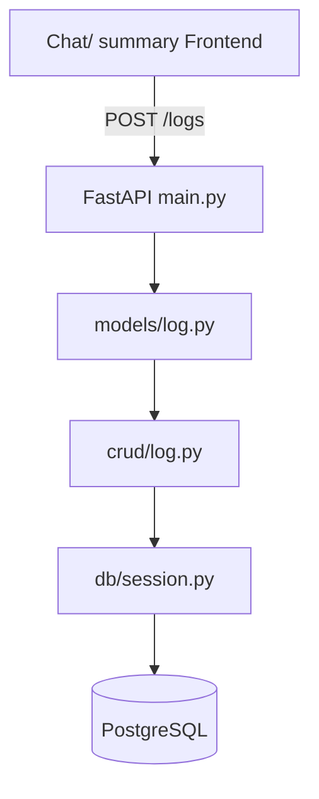

## 📄 **`README.md`**

```markdown
# GutIQ Backend 

AI-powered digestive health logging API. Chatbot/ User Summary → Decoded with NLP → Saved to PostgreSQL → Use RAG with medical documents to provide insights.

## 🚀 Quick Start

### 1. Setup Virtual Environment
```bash
# Create virtual environment
python -m venv .venv

# Activate (Windows)
.venv\Scripts\activate

# Activate (Mac/Linux)  
source .venv/bin/activate

# Verify you're in venv (should see (.venv) prefix in terminal line)
which python  # or `where python` on Windows
```

### 2. Install Dependencies
```bash
pip install -r requirements.txt
```

### 3. Start Development Server
```bash
uvicorn src.gutiq.main:app --reload --host 0.0.0.0 --port 8000
```

### 4. Open API Docs
```
http://localhost:8000/docs
http://localhost:8000/redoc
```

**Test endpoint:**
```bash
curl -X POST "http://localhost:8000/api/v1/logs" \
  -H "Content-Type: application/json" \
  -d '{
    "log_date": "2026-02-23",
    "sleep_hours": 6.5,
    "stress_level": 7,
    "exercise_minutes": 30,
    "foods": "tacos, coffee",
    "symptoms": "heartburn",
    "severity": 6
  }'
```

## 🗂️ Project Structure

```
src/gutiq/
├── main.py           # FastAPI app entrypoint
├── api/v1/           # HTTP endpoints (POST /logs)
├── models/           # Pydantic validation (LogCreate)
├── crud/             # Database operations (Week 2)
├── db/               # PostgreSQL connections
├── core/             # Config, JWT, settings
└── schemas/          # SQLAlchemy DB models
```

**Fixed schema** — `log_time` → `log_date`, **complete 2-table plan**:

***

## 📊 **Database Schema (MVP)**

### **Table 1: `users`**
| Column | Type | Description |
|--------|------|-------------|
| `id` | UUID **PK** | Unique user ID |
| `email` | VARCHAR **UNIQUE** | Login email |
| `digestive_condition` | VARCHAR | "GERD", "IBS", "ulcers" |
| `onboarding_goal` | VARCHAR | "understand_triggers" |
| `created_at` | TIMESTAMP | Signup time |

### **Table 2: `logs`**
| Column | Type | Description |
|--------|------|-------------|
| `id` | UUID **PK** | Unique log ID |
| `user_id` | UUID **FK** | Links to `users.id` |
 **`log_date`** | **DATE** | **Day of log** |
| `sleep_hours` | FLOAT | 0-12 hours |
| `stress_level` | INT | 1-10 |
| `exercise_minutes` | INT | 0-600 |
| `exercise_notes` | TEXT | "weights, yoga" |
| `foods` | TEXT | "tacos, coffee" |
| `symptoms` | TEXT | "heartburn, bloating" |
| `severity` | INT | 1-10 |
| `additional_notes` | TEXT | "rainy day, Tums" |
| `created_at` | TIMESTAMP | Log creation |

***

## 🔗 **Relationship**
```
users (1) ──✦─── (*) logs
Maria → [2026-02-23 log][2026-02-24 log][2026-02-25 log]
```

## 🛠️ Development Workflow



## 🔮 Next Steps
- Week 2: PostgreSQL + SQLAlchemy
- Week 3: Gemini NLP chatbot parsing/ User Sumamry
- Week 4: LangChain RAG analysis
- Week 6: Railway deployment ($0)
```
