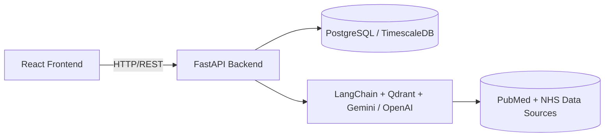

# System Architecture

This document describes the overall architecture of **GutIQ**, an AI-assisted digestive health platform.

**Components:**
- **React Frontend:** User interface for logging meals, tracking symptoms, and viewing insights and medical advice.
- **FastAPI:** Backend handling user authentication, API endpoints, and connection to the AI layer.
- **LangChain / Qdrant:** Handles document retrieval and semantic search for relevant medical resources.
- **PostgreSQL / TimescaleDB:** Stores user logs, symptoms, and time-series data.
- **GCP / Docker Environment:** Used for scalable deployment.

