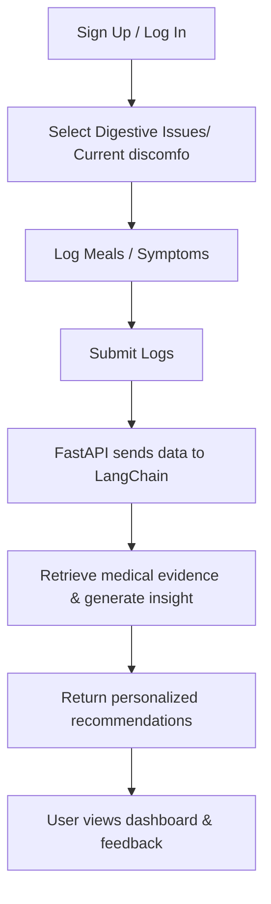

# User Flow

This document outlines the end‑to‑end flow for a GutIQ user.

**Summary:**  
The user signs in, logs data, runs analysis, receives insights and maybe posture advice with supporting medical explanations, and provides feedback for system improvement.
